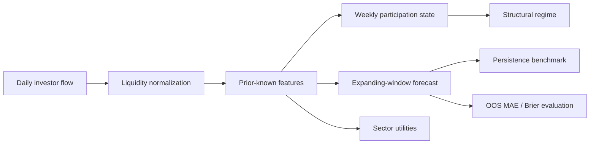

# KR-CapFlow — Public Portfolio Edition

A compact, reproducible research framework for studying **Korean equity investor flows** across foreign, institutional and retail participants.

This repository is a public portfolio snapshot derived from a larger private research project. It preserves the core research ideas—point-in-time feature construction, flow-state/regime analysis, expanding-window out-of-sample forecasting and benchmark-relative evaluation—while removing licensed data, vendor-specific mappings and private operational logic.

## Research question

> Do observable investor-flow dynamics contain incremental information about subsequent investor flows, market states and sector behavior?

The public demo focuses on the first-stage question: **forecasting future normalized investor flow** rather than claiming direct return predictability.

## What this repository demonstrates

- Foreign / institution / retail flow normalization by prior-known market liquidity
- Time-ordered feature engineering designed to avoid look-ahead leakage
- Weekly investor-participation shares and persistent structural-regime classification
- Expanding-window ridge forecasts for future normalized flow
- Comparison against a persistence benchmark
- Direction-probability evaluation with Brier score
- Sector excess-return and sector-flow utilities
- Synthetic, fully reproducible example data and tests

## Architecture



## Repository layout

```text
KR-CapFlow/
├─ src/kr_capflow_public/
│  ├─ features.py      # PIT-safe transformations and normalized-flow features
│  ├─ regimes.py       # structural investor-flow regime classification
│  ├─ forecast.py      # expanding-window ridge forecast + benchmark evaluation
│  ├─ sector.py        # sector excess-return / flow utilities
│  └─ pipeline.py      # compact end-to-end research workflow
├─ data/
│  └─ synthetic_kr_capflow.csv
├─ examples/
│  └─ run_demo.py
├─ artifacts/
│  ├─ demo_metrics.csv
│  └─ demo_regime_snapshot.csv
├─ tests/
├─ docs/
└─ NOTICE.md
```

## Quick start

```bash
python -m venv .venv
# Windows: .venv\Scripts\activate
# macOS/Linux: source .venv/bin/activate
pip install -e ".[dev]"
python examples/run_demo.py
pytest -q
```

The demo writes compact outputs to `artifacts/` and uses only the synthetic CSV included in the repository.

## Methodology in one page

1. **Normalize flow** — each investor's net flow is divided by a trailing liquidity measure calculated only from observations available at the origin date.
2. **Create prior-known features** — lags, rolling means, positive-flow shares and market-state controls use backward-looking windows only.
3. **Define targets** — future normalized flow is constructed over fixed horizons and is never used in same-origin feature construction.
4. **Walk forward** — every forecast is fitted only on observations preceding the forecast origin.
5. **Benchmark explicitly** — model errors are compared with a simple persistence forecast rather than evaluated in isolation.
6. **Separate diagnosis from prediction** — investor-flow regimes describe the current/lagged state; they are not treated as proof of future-return causality.

See [`docs/methodology.md`](docs/methodology.md) for details.

## Public vs. private scope

This portfolio edition is deliberately smaller than the private research engine. Exact data-vendor mappings, workbook integration, release/audit machinery, production thresholds and live research outputs are not published. Demonstration defaults in this repository should therefore **not** be interpreted as the frozen parameterization of the private project.

See [`docs/public_release_scope.md`](docs/public_release_scope.md).

## Interpretation

The included metrics are generated from **synthetic observations**. They validate code paths and research design; they do not represent historical KRX performance and should not be cited as empirical investment results.
